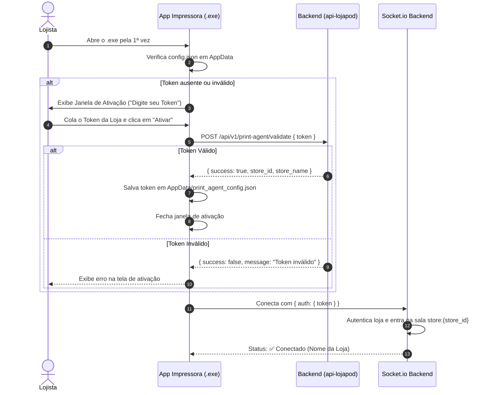

# Planejamento: Ativação por Token da Impressora (Multi-lojas com mesmo .exe)

## 📌 Objetivo
Permitir que o mesmo executável (`print-agent-setup.exe`) seja distribuído e instalado em qualquer loja/cliente. A identificação da loja será feita através de um **Token de Ativação** inserido no app no primeiro uso e salvo localmente no computador da loja.

---

## 🏗️ Arquitetura & Fluxo da Solução



---

## 🛠️ Detalhamento dos Componentes

### 1. Backend (`api-lojapod`)

- **Geração de Token**:
  - Garantir que a entidade `Store` possua o campo `printToken` (string única/hash). Exemplo: `PRT-987654321`.
- **Endpoint de Validação**:
  - `POST /api/v1/print-agent/validate`
  - Body: `{ "token": "PRT-987654321" }`
  - Resposta: `{ "success": true, "store_id": "123", "store_name": "Loja Centro" }`
- **Middleware Socket.io**:
  - Validar o `token` enviado no handshake (`socket.handshake.auth.token` ou `socket.handshake.query.token`).
  - Associar o socket à sala da loja: `socket.join(`store:${store.id}`)`.

---

### 2. Painel Admin (`admin-lojapod`)

- Exibir na página de Configurações da Loja ou Impressora o **Token da Impressora** da loja ativa.
- Botão simples de "Copiar Token" para o lojista colar no aplicativo `.exe`.

---

### 3. Agente de Impressão Electron (`print-lojapod`)

- **Armazenamento de Configuração (`config.json`)**:
  - Salvo em `app.getPath('userData')` (Pasta `%APPDATA%/Loja pod/print_agent_config.json`).
  - Estrutura:
    ```json
    {
      "token": "PRT-987654321",
      "store_id": "123",
      "store_name": "Loja Centro",
      "printer": "printer:Epson TM-T20"
    }
    ```

- **Janela de Ativação Modal (`BrowserWindow`)**:
  - Exibida automaticamente se `token` não existir ou for rejeitado pelo backend.
  - Form: Input para o Token + Botão "Ativar Impressora" + Mensagem de erro.

- **Menu da Bandeja (Tray Menu)**:
  - Exibe o status da conexão: `Status: ✅ Conectado (Loja Centro)`
  - Opção: `Alterar Token / Trocar Loja` -> Abre a Janela de Ativação a qualquer momento.
  - Opção: `Selecionar Impressora` (já existente).
  - Opção: `Testar Impressão` -> Emite cupom de teste.

---

## 📋 Checklist de Implementação

- [ ] **Backend**: Adicionar/verificar campo `printToken` no modelo da Loja no banco de dados.
- [ ] **Backend**: Criar rota `POST /api/v1/print-agent/validate`.
- [ ] **Backend**: Atualizar autenticação do Socket.io para aceitar `token` de impressão.
- [ ] **Admin**: Adicionar campo de exibição/cópia do `printToken` no painel web.
- [ ] **Electron**: Implementar janela de ativação HTML/IPC no [main.js](file:///c:/sites/lojapod/print-lojapod/main.js).
- [ ] **Electron**: Atualizar funções `loadConfig()` e `saveConfig()` em `%APPDATA%`.
- [ ] **Electron**: Adicionar opção no Tray Menu para trocar token/desconectar.
- [ ] **Build**: Gerar o executável único `print-agent-setup.exe` via `npm run build`.
